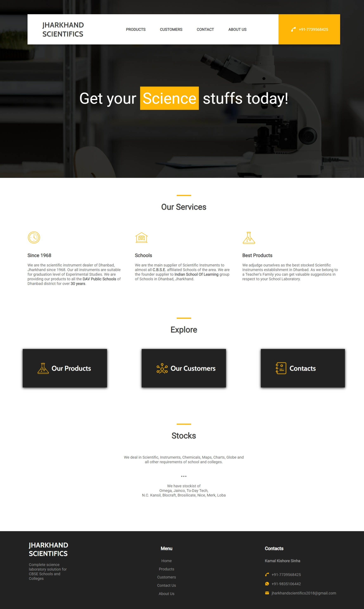

# Jharkhand Scientifics
A responsive and user-friendly website designed to market and showcase scientific equipment. Built using **React JS**, **HTML**, and **CSS**, it offers an intuitive interface for users to browse and explore products.
  
## Landing Page
The landing page provides a professional and user-friendly interface with links to explore **Products**, **Customers**, and **Contact** sections. A footer includes essential details like **email** and **phone** for easy communication, ensuring a seamless user experience.

#### Mobile View

 

## Product Page
The **Product Page** allows users to explore a variety of scientific equipment across multiple categories such as **Mathematics**, **Physics**, **Chemistry**, and more. Users can easily view the equipment by selecting a specific category and adjusting the size options to see relevant products. Each product includes detailed descriptions and pricing, making it simple for users to find the equipment they need.

 

## Customers
The **Customer Page** highlights the diverse range of clients who trust our products. It includes detailed information about each customer, such as their **school or organization name**, **location**, and the **number of years** they’ve been purchasing from us. This page serves as a testament to our long-term relationships with valued clients and showcases the trust they place in our scientific equipment.

 

## Contacts
The **Contact Page** provides all the essential details for reaching out to the shop. It includes the **address**, **email**, and **phone number** for direct communication. Additionally, an embedded **Google Maps iframe** is included to show the exact location of the shop, making it easy for visitors to find it.

